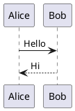

# Obsidian PlantUML Renderer

Renders PlantUML diagrams in Obsidian using a local PlantUML JAR. Diagrams are written to a temporary file alongside the markdown so PlantUML resolves `!include` paths natively — no preprocessing required.

## How it works

When a `plantuml` code block is rendered, the plugin resolves all `!include` directives recursively before passing the source to PlantUML. Includes are resolved relative to the markdown file's location, matching PlantUML's own path semantics. Already-included files are tracked and skipped, providing `!include_once` semantics automatically.

The resolved source is piped to a persistent PlantUML JAR process over stdin, and the SVG response is read back from stdout. Keeping the JVM alive across renders avoids the startup cost on every diagram.

## Why JAR-direct?

**Local PlantUML server** (e.g. `java -jar plantuml.jar -picoweb`) encodes diagrams in the request URL, which has an ~8 KB limit. Large diagrams with many `!include` files can exceed this and fail to render. It also requires a separate process to be running.

**Remote rendering** (e.g. `plantuml.com`) requires sending diagram source over the internet, which may not be suitable for proprietary or confidential content.

**JAR-direct** sidesteps the URL size constraint and keeps everything local, with `!include` resolution handled natively by PlantUML.

## Requirements

- **Java** — available at `/usr/bin/java` or configured below
- **PlantUML JAR** — download from [plantuml.com](https://plantuml.com/download)
- **Graphviz** (optional) — required for certain diagram types (e.g. component, deployment)

## Installation

### Via BRAT (recommended)

1. Install the [BRAT](https://github.com/TfTHacker/obsidian42-brat) community plugin
2. Open **Settings → BRAT → Add Beta Plugin**
3. Enter this repository URL
4. Enable the plugin in **Settings → Community Plugins**

### Manual

1. Download `main.js` and `manifest.json` from the [latest release](../../releases/latest)
2. Create a folder `.obsidian/plugins/obsidian-plantuml-renderer/` in your vault
3. Copy both files into that folder
4. Enable the plugin in **Settings → Community Plugins**

## Configuration

Open **Settings → Obsidian PlantUML Renderer** and set:

| Setting | Default | Description |
|---------|---------|-------------|
| PlantUML JAR path | _(required)_ | Absolute path to `plantuml.jar` |
| Java path | `/usr/bin/java` | Path to the `java` executable |
| Graphviz dot path | `/opt/homebrew/bin/dot` | Path to the `dot` executable |

## Usage

Wrap PlantUML source in a `plantuml` fenced code block:

~~~markdown

~~~

`!include` directives are resolved relative to the markdown file's location, so relative paths work exactly as they do when running PlantUML directly.

## Diagram Navigation

Rendered diagrams are interactive. Large diagrams are scaled down to fit the note width automatically.

| Action | Effect |
|--------|--------|
| Cmd+Scroll | Zoom in / out toward the cursor |
| Drag | Pan around the diagram |
| Double-click | Reset to fit-to-width |
| Drag bottom edge | Resize the container vertically |

## Error Output

PlantUML returns an SVG even on syntax errors — the error message is embedded in the image itself. The plugin renders it as-is; there is no separate error state.

## Notes

- Desktop only — requires local Java and JAR
- Temporary files (`.plantuml-tmp-*`) are written alongside the markdown during rendering and deleted immediately after
