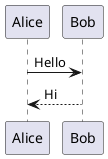

# Obsidian PlantUML Renderer

Renders PlantUML diagrams in Obsidian using a local PlantUML JAR. Diagrams are written to a temporary file alongside the markdown so PlantUML resolves `!include` paths natively — no preprocessing required.

## Requirements

- **Java** — available at `/usr/bin/java` or configured below
- **PlantUML JAR** — download from [plantuml.com](https://plantuml.com/download)
- **Graphviz** (optional) — required for certain diagram types (e.g. component, deployment)

## Installation

### Via BRAT (recommended)

1. Install the [BRAT](https://github.com/TfTHacker/obsidian42-brat) community plugin
2. Open **Settings → BRAT → Add Beta Plugin**
3. Enter this repository URL
4. Enable the plugin in **Settings → Community Plugins**

### Manual

1. Download `main.js` and `manifest.json` from the [latest release](../../releases/latest)
2. Create a folder `.obsidian/plugins/obsidian-plantuml-renderer/` in your vault
3. Copy both files into that folder
4. Enable the plugin in **Settings → Community Plugins**

## Configuration

Open **Settings → Obsidian PlantUML Renderer** and set:

| Setting | Default | Description |
|---------|---------|-------------|
| PlantUML JAR path | _(required)_ | Absolute path to `plantuml.jar` |
| Java path | `/usr/bin/java` | Path to the `java` executable |
| Graphviz dot path | `/opt/homebrew/bin/dot` | Path to the `dot` executable |

## Usage

Wrap PlantUML source in a `plantuml` fenced code block:

~~~markdown

~~~

`!include` directives are resolved relative to the markdown file's location, so relative paths work exactly as they do when running PlantUML directly.

## Error Output

If PlantUML reports a syntax error, the error text is displayed below the error image in a readable block.

## Notes

- Desktop only — requires local Java and JAR
- Temporary files (`.plantuml-tmp-*`) are written alongside the markdown during rendering and deleted immediately after
